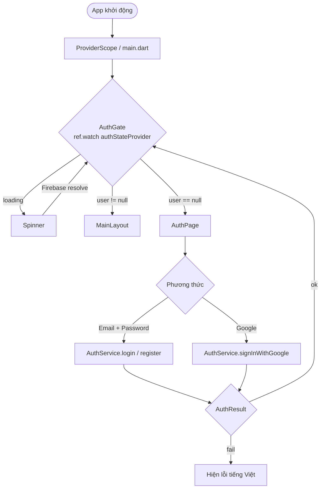
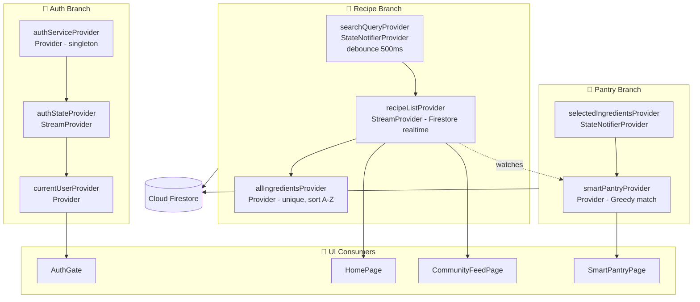
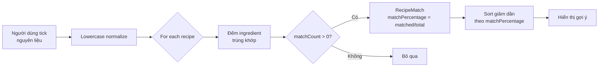
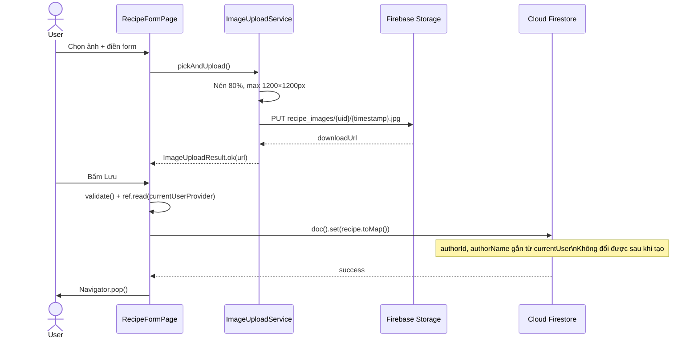

# 🍳 Recipe App

> Ứng dụng chia sẻ công thức nấu ăn cộng đồng, đa nền tảng — xây dựng với **Flutter** & **Firebase**.

[](https://flutter.dev)
[](https://dart.dev)
[](https://firebase.google.com)
[](LICENSE)
[](https://flutter.dev/multi-platform)

---

## 📋 Mục Lục

- [Giới thiệu](#-giới-thiệu)
- [Tính năng](#-tính-năng)
- [Tech Stack & Kiến trúc](#-tech-stack--kiến-trúc)
- [Cấu trúc thư mục](#-cấu-trúc-thư-mục)
- [Cách Vận Hành](#-cách-vận-hành)
  - [1. Auth Flow — Luồng xác thực](#1-auth-flow--luồng-xác-thực)
  - [2. Riverpod Provider Tree](#2-riverpod-provider-tree)
  - [3. Tìm kiếm & Smart Pantry](#3-tìm-kiếm--smart-pantry)
  - [4. Upload ảnh & Lưu công thức](#4-upload-ảnh--lưu-công-thức)
  - [5. Firestore Security — 3 lớp kiểm soát](#5-firestore-security--3-lớp-kiểm-soát)
- [Bắt đầu](#-bắt-đầu)
- [Cấu hình Firebase](#-cấu-hình-firebase)
- [Chạy ứng dụng](#-chạy-ứng-dụng)
- [Firestore Security Rules](#-firestore-security-rules)
- [Tác giả](#-tác-giả)

---

## 🌟 Giới Thiệu

**Recipe App** là ứng dụng di động đa nền tảng (Android & iOS) giúp người dùng:

- **Khám phá** các công thức nấu ăn từ cộng đồng
- **Sáng tạo & chia sẻ** món ăn của riêng mình
- **Quản lý tủ lạnh thông minh** — gợi ý món ăn dựa trên nguyên liệu sẵn có

Dự án áp dụng kiến trúc **MVVM** kết hợp **Riverpod** cho state management và **Firebase** làm backend hoàn chỉnh.

---

## ✨ Tính Năng

| Tính năng | Mô tả |
|-----------|-------|
| 🔐 **Xác thực người dùng** | Đăng ký / Đăng nhập bằng Email + Password và Google Sign-In |
| 🏠 **Trang chủ** | Hiển thị công thức mới nhất, hero header, shimmer loading, tìm kiếm |
| 🧊 **Smart Pantry** | Nhập nguyên liệu có sẵn → app gợi ý món ăn phù hợp |
| 📖 **Chi tiết công thức** | Xem nguyên liệu, các bước thực hiện, tác giả, thời gian nấu |
| 📝 **Tạo công thức** | Form nhập liệu đầy đủ, upload ảnh lên Firebase Storage |
| 🌐 **Community Feed** | Lướt & khám phá công thức công khai của cộng đồng |
| 🔒 **Bảo mật dữ liệu** | Firestore Security Rules nghiêm ngặt, chỉ tác giả mới sửa/xóa |
| 📱 **Offline support** | Firestore persistence — đọc được dữ liệu khi mất mạng |

---

## 🛠 Tech Stack & Kiến Trúc

```
┌─────────────────────────────────────────────────────┐
│                   Flutter (Dart)                    │
│                                                     │
│  View Layer          ViewModel Layer   Model Layer  │
│  ┌──────────┐        ┌─────────────┐  ┌──────────┐ │
│  │  Screens │◄──────►│  Providers  │◄►│  Models  │ │
│  │  Widgets │        │  (Riverpod) │  │ Services │ │
│  └──────────┘        └─────────────┘  └────┬─────┘ │
└────────────────────────────────────────────┼────────┘
                                             │
                              ┌──────────────▼───────────────┐
                              │          Firebase             │
                              │  Auth │ Firestore │ Storage  │
                              └───────────────────────────────┘
```

### Thư viện chính

| Package | Phiên bản | Mục đích |
|---------|-----------|----------|
| `flutter_riverpod` | ^2.5.1 | State management (MVVM) |
| `firebase_auth` | ^6.3.0 | Xác thực người dùng |
| `cloud_firestore` | ^6.2.0 | Cơ sở dữ liệu realtime |
| `firebase_storage` | 13.2.0 | Lưu trữ ảnh món ăn |
| `google_sign_in` | ^6.2.2 | Đăng nhập Google |
| `image_picker` | ^1.1.2 | Chọn ảnh từ thiết bị |
| `cached_network_image` | ^3.4.1 | Cache ảnh, tối ưu hiệu năng |
| `shimmer` | ^3.0.0 | Skeleton loading UI |
| `go_router` | ^14.6.3 | Navigation & routing |
| `uuid` | ^4.3.3 | Tạo ID duy nhất |

---

## 📂 Cấu Trúc Thư Mục

```
lib/
├── core/
│   └── app_theme.dart              # Theme, màu sắc, border radius toàn cục
│
├── models/
│   ├── recipe.dart                 # Model công thức (title, ingredients, steps, author...)
│   └── ingredient.dart             # Model nguyên liệu (name, amount, unit)
│
├── services/
│   ├── auth_service.dart           # Đăng ký, đăng nhập, Google Sign-In, logout
│   └── image_upload_service.dart   # Upload ảnh lên Firebase Storage
│
├── viewmodels/
│   ├── auth_provider.dart          # Riverpod provider: trạng thái Auth
│   ├── recipe_provider.dart        # Riverpod provider: danh sách công thức
│   └── pantry_provider.dart        # Riverpod provider: Smart Pantry logic
│
├── views/
│   ├── auth_page.dart              # Màn hình đăng nhập / đăng ký
│   ├── home_page.dart              # Trang chủ, danh sách công thức
│   ├── main_layout.dart            # Bottom navigation, Auth Gate
│   ├── recipe_detail_page.dart     # Chi tiết công thức
│   ├── recipe_form_page.dart       # Form tạo / chỉnh sửa công thức
│   ├── smart_pantry_page.dart      # Tủ lạnh thông minh
│   └── community_feed_page.dart    # Feed cộng đồng
│
├── widgets/
│   ├── animated_scale_card.dart    # Card có hiệu ứng scale khi nhấn
│   ├── app_cached_image.dart       # Image widget với cache & placeholder
│   ├── home_hero_header.dart       # Header nổi bật trang chủ
│   ├── home_search_bar.dart        # Thanh tìm kiếm
│   ├── large_recipe_card.dart      # Card công thức lớn (ngang)
│   └── small_recipe_card.dart      # Card công thức nhỏ (dọc)
│
├── firebase_options.dart           # Cấu hình Firebase cho từng nền tảng
└── main.dart                       # Entry point, ProviderScope, AuthGate
```

---

## ⚙️ Cách Vận Hành

### 1. Auth Flow — Luồng xác thực

App dùng pattern **AuthGate** đặt ngay tại `main.dart`. Thay vì điều hướng thủ công, `AuthGate` lắng nghe `authStateProvider` — một `StreamProvider` bọc `FirebaseAuth.authStateChanges()`. Mỗi khi trạng thái đăng nhập thay đổi, stream tự emit và toàn bộ UI phản ứng mà không cần `Navigator.push` ở bất cứ đâu.

`AuthService` trả về `AuthResult` (thay vì throw exception) để tầng UI xử lý lỗi sạch. Lỗi Firebase được dịch sang tiếng Việt ngay trong `_mapErrorCode()`.



---

### 2. Riverpod Provider Tree

Toàn bộ state được tổ chức thành 3 nhánh độc lập, mỗi nhánh phụ trách một domain riêng:



> `IndexedStack` trong `MainLayout` giữ tất cả các tab luôn sống — không bị rebuild khi chuyển tab, tránh re-fetch Firestore không cần thiết.

---

### 3. Tìm kiếm & Smart Pantry

**Tìm kiếm công thức** dùng kỹ thuật **debounce 500ms**: mỗi lần người dùng gõ, `SearchNotifier` hủy timer cũ và đặt lại timer mới. Chỉ khi dừng gõ 0.5 giây, từ khóa mới được push vào `searchQueryProvider` và Firestore mới được gọi.

Firestore không cho kết hợp `orderBy` với range query trên field khác, nên khi tìm kiếm, app dùng trick prefix-match:

```dart
// Prefix match không cần index phức tạp
.where('title', isGreaterThanOrEqualTo: query)
.where('title', isLessThan: '$query\uf8ff')
```

**Smart Pantry** dùng thuật toán **Greedy Match** phía client:



`RecipeMatch` lưu cả `matchedCount` và `totalCount` — hiển thị phần trăm phù hợp cho người dùng (ví dụ: *"Có 3/4 nguyên liệu"*).

---

### 4. Upload ảnh & Lưu công thức

`RecipeFormPage` hoạt động theo 2 mode — **tạo mới** hoặc **chỉnh sửa** — qua một param `existingRecipe`. Nếu được truyền vào, form tự điền sẵn toàn bộ dữ liệu.



`authorId` và `authorName` được gắn cứng lúc tạo và **không cho phép thay đổi** — `Recipe.copyWith()` bỏ qua hai field này để ngăn giả mạo tác giả.

---

### 5. Firestore Security — 3 lớp kiểm soát

Rules hoạt động theo nguyên tắc **deny by default** — mọi thứ không được liệt kê đều bị từ chối tự động.

| Thao tác | Điều kiện |
|----------|-----------|
| `read` recipe | `isPublic == true` **hoặc** `authorId == uid` |
| `create` recipe | Đã đăng nhập + `isValidRecipe()` pass |
| `update` recipe | Chỉ tác giả + không đổi được `authorId` & `createdAt` |
| `delete` recipe | Chỉ tác giả |
| `read/write` user | Chỉ bản thân, không tự đặt field `role` |
| `delete` user | Không ai được xóa (kể cả bản thân) |

`isValidRecipe()` validate phía server: `title` không rỗng, không vượt 200 ký tự, `authorId` phải khớp `uid` đang đăng nhập, `isPublic` phải là `bool`.

---

## 🚀 Bắt Đầu

### Yêu cầu

- [Flutter SDK](https://docs.flutter.dev/get-started/install) `>= 3.x` (Dart `^3.10.1`)
- Android Studio / VS Code với Flutter plugin
- Tài khoản [Firebase](https://firebase.google.com)
- Thiết bị thật hoặc emulator (Android / iOS)

### Cài đặt

```bash
# 1. Clone repository
git clone https://github.com/Tuanask4/RecipeApp_Tuan_Giap_1_2026.git
cd RecipeApp_Tuan_Giap_1_2026

# 2. Cài dependencies
flutter pub get

# 3. Kiểm tra môi trường
flutter doctor
```

---

## 🔥 Cấu Hình Firebase

> ⚠️ File `google-services.json` và `firebase_options.dart` trong repo này được cấu hình cho môi trường phát triển. Khi deploy production, hãy tạo Firebase project riêng.

### Các bước thiết lập Firebase mới

```bash
# Cài Firebase CLI
npm install -g firebase-tools

# Đăng nhập
firebase login

# Cài FlutterFire CLI
dart pub global activate flutterfire_cli

# Cấu hình Firebase cho project Flutter
flutterfire configure
```

**Kích hoạt trong Firebase Console:**

1. **Authentication** → Bật *Email/Password* và *Google Sign-In*
2. **Cloud Firestore** → Tạo database, chọn region phù hợp
3. **Firebase Storage** → Tạo bucket để lưu ảnh món ăn

### Deploy Firestore Rules

```bash
firebase deploy --only firestore:rules
```

---

## ▶️ Chạy Ứng Dụng

```bash
# Chạy ở chế độ debug
flutter run

# Chạy trên thiết bị cụ thể
flutter run -d <device_id>

# Build APK release
flutter build apk --release

# Build iOS release
flutter build ios --release
```

---

## 🔒 Firestore Security Rules

Dự án áp dụng security rules bảo mật chặt chẽ:

```
/recipes/{recipeId}
  ├── read:   Public nếu isPublic=true, hoặc chỉ tác giả
  ├── create: Phải đăng nhập + dữ liệu hợp lệ
  ├── update: Chỉ tác giả, không đổi được authorId & createdAt
  └── delete: Chỉ tác giả

/users/{userId}
  ├── read:   Chỉ bản thân
  ├── create/update: Chỉ bản thân, không được tự đặt role admin
  └── delete: Không ai được xóa (kể cả bản thân)
```

> Xem chi tiết: [`firestore.rules`](./firestore.rules)

---
